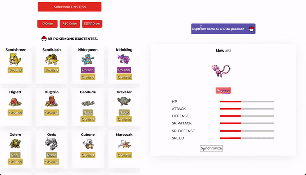

# POKÉDEX



## How to install

### First step - clone the repository

```bash
git clone https://github.com/VictorMonteiro7/pokemon
```

### Second step - install the dependencies

In the project folder, do:

```bash
npm install
```

### Third step - init the project

```bash
npm start
```
